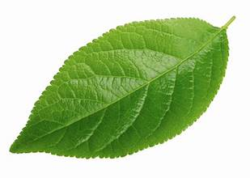

# 🥔 Potato Leaf Disease Detection – Smart Crop Health Identifier  
**🔗 Live Demo**: [https://your-frontend-url.netlify.app](https://your-frontend-url.netlify.app)  

<table>
<tr>
<td>

</td>
<td>
<b><i>This AI-powered web app lets users detect potato leaf diseases like Early Blight or Late Blight just by uploading a leaf image. Trained using real plant disease data, the app uses a TensorFlow CNN model and a sleek React frontend. Smart, fast, and simple crop health monitoring for everyone.</i></b>
</td>
</tr>
</table>

---

## ✨ Key Highlights & New Additions

- 🧠 **AI-Based Leaf Disease Prediction**  
  Upload a photo of a potato leaf and get an instant diagnosis powered by TensorFlow CNN.

- ⚙️ **Google Cloud Function Deployment**  
  Lightweight, serverless backend hosted via GCP with integrated model loading.

- 🎯 **Confidence Score**  
  See how confident the model is in its prediction with clean percentages.

- 🌍 **Fully Hosted**  
  Frontend on **Netlify**, backend on **Google Cloud Functions** for a scalable experience.

---

## 📦 Features

- 📷 **Image Upload** for prediction  
- 🧪 **Trained CNN Model** (Early Blight, Late Blight, Healthy)  
- 📊 **Instant Class & Confidence Output**  
- 🌐 **Cross-Origin Ready** (CORS headers configured)  
- 🖼️ **Responsive Frontend UI**  
- 🧰 **Easy Deployment on GCP & Netlify**

---

## 🧠 ML Model Info

- Framework: **TensorFlow 2.16**  
- Classes Detected:
  - Early Blight
  - Late Blight
  - Healthy
- Dataset: Subset of [PlantVillage Dataset](https://www.kaggle.com/emmarex/plantdisease)  
- Retrained and converted from TensorFlow 2.5 to 2.16 for GCP compatibility.

---

## 🛠️ Technologies Used

### 🤖 Machine Learning:
| Name         | Info |
|--------------|------|
| TensorFlow   | CNN model trained on image data |
| NumPy & PIL  | Image processing and resizing |

### 🌐 Web Development:
| Name       | Description |
|------------|-------------|
| React.js   | Frontend framework |
| Axios      | API calls to GCP |
| Netlify    | Static hosting for frontend |
| Google Cloud Functions | Serverless backend |

### 🔧 Backend Utilities:
| Name         | Purpose |
|--------------|---------|
| Flask (GCP-compatible) | API logic for prediction |
| Google Cloud Storage   | Loads `.h5` model on-demand |

---

## ▶️ How to Use the App

### 1. Upload a Leaf Image
Click the upload button and choose a potato leaf image (PNG/JPG).

### 2. Wait for Prediction
The app will send the image to the backend and return:
- Predicted disease
- Confidence percentage

### 3. Interpret & Act
Based on the result, users can take proper action (treat for disease or confirm health).

---
